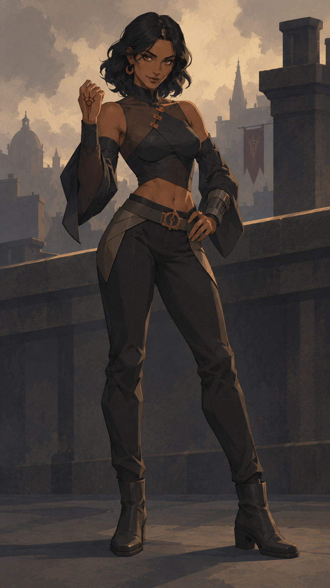

# Referência visual de Astrael v2

A referência principal aprovada é [isis_telhado.png](isis_telhado.png), a arte da Isis no telhado gerada na conversa de desenvolvimento da v2.

Use esta imagem junto com o prompt do personagem. Preserve sua estilização geométrica, anatomia simplificada, massas de cor e acabamento fosco; o template pede apenas um pouco mais de profundidade nas sombras.

Transfira o estilo, não a identidade, o figurino, a runa ou o cenário da Isis. Os campos de cada personagem definem esses elementos. Não substitua esta referência por outra geração sem orientação do usuário.
